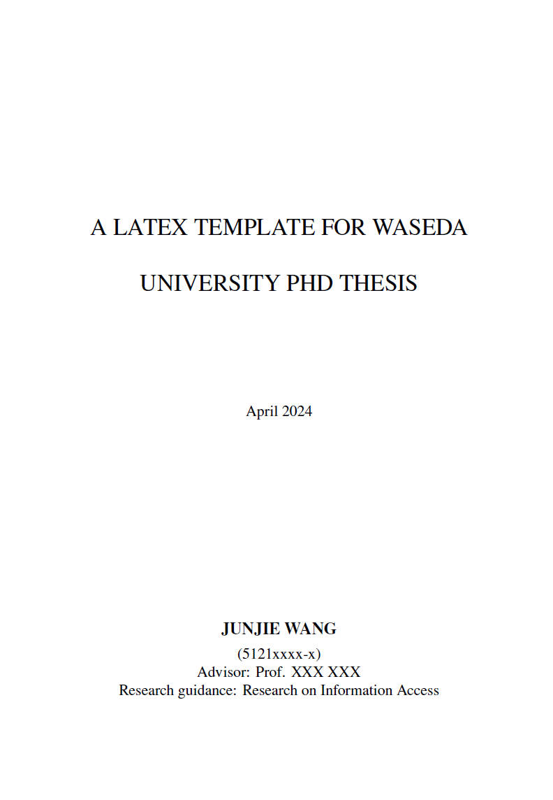
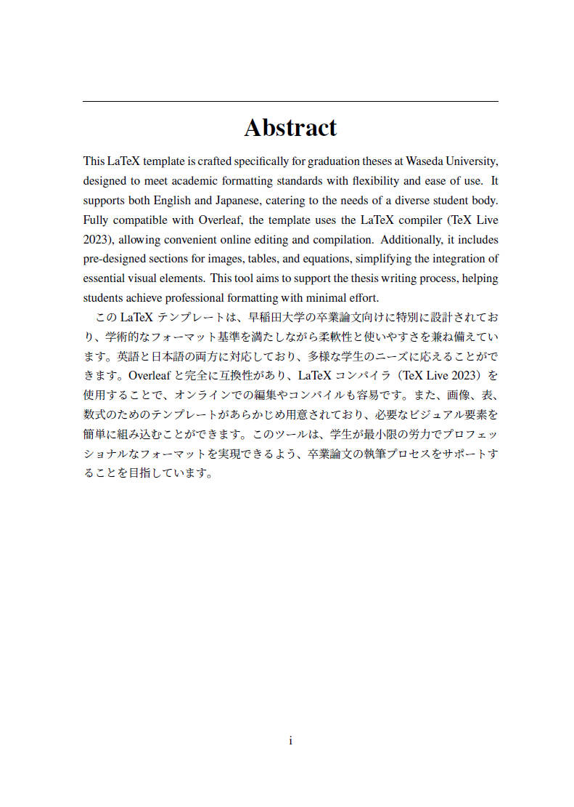
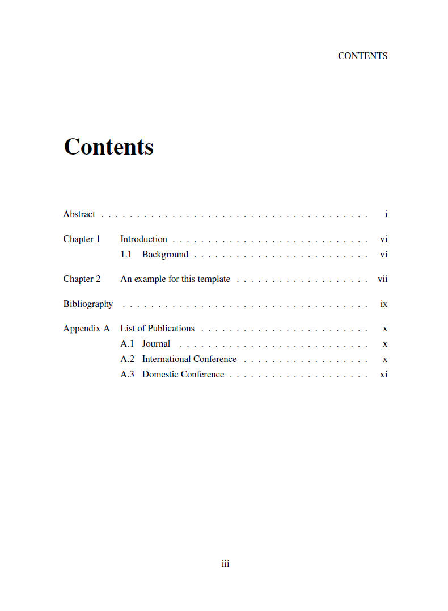

# Comprehensive LaTeX Template for Waseda University PhD Theses: Dual Language Support and Overleaf Compatibility

This repository provides a comprehensive LaTeX template specifically designed for graduation theses at Waseda University. This template ensures compliance with academic formatting standards, while also being flexible and user-friendly, suitable for both Japanese and international students.

**Features**
- Dual-Language Support: Compatible with both English and Japanese, catering to a diverse range of users.
- Overleaf Compatibility: Fully supports Overleaf with **LaTeX** compiler settings (TeX Live **2023**) for easy online editing and compilation.
- Pre-Formatted Sections: Includes ready-to-use sections for images, tables, and equations, simplifying the process of adding visual and technical content.

# Example Pages







# Cite

```
@misc{wang2024waseda,
  author = {Wang, Junjie and Zhang, Yuxiang},
  title = {A LaTeX Template for Waseda University PhD Thesis},
  year = {2024},
  publisher = {GitHub},
  journal = {GitHub repository},
  howpublished = {\url{https://github.com/wanng-ide/phd_thesis_template_waseda_university}}
}
```
